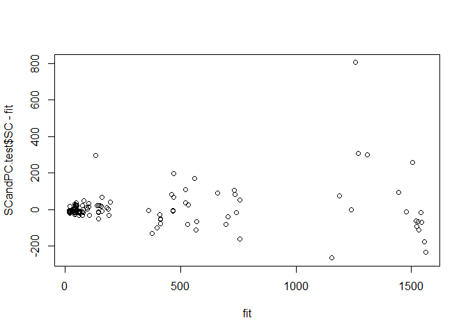

Анализ зависимости количества обращений пользователей от числа обслуживаемых рабочих мест
========================================================


Целью анализа является построение модели, выявлеющей закономерность в количестве обращений пользователей от числа обслуживаемых рабочих мест.

### Получение данных

Загружаем исходные данные

```r
SCandPC.raw<-readRDS("SC_and_PC.RDa")
# Dimension of dataset
dim(SCandPC.raw)
```

```
## [1] 642   5
```

```r
# First rows
head(SCandPC.raw)
```

```
##   Year Month   Org   PC  SC
## 1 2010     1 Org_1   34  33
## 2 2010     1 Org_2 1140 890
## 3 2010     1 Org_4    7  16
## 4 2010     1 Org_5  432 153
## 5 2010     1 Org_6    6   5
## 6 2010     1 Org_8  159  90
```

### Регрессионный анализ зависимости количества обращений пользователей от числа обслуживаемых рабочих мест как процесса

Проведем анализ только по всем предприятиям, для чего просуммируем данные по всем предприятиям для каждого периода и построим линейную модель КМНК.


```r
SCandPC.sum<-aggregate(cbind(PC,SC)~Month+Year,data=SCandPC.raw,sum)
dim(SCandPC.sum)
```

```
## [1] 52  4
```

```r
head(SCandPC.sum)
```

```
##   Month Year   PC   SC
## 1     1 2010 2552 1792
## 2     2 2010 2560 2139
## 3     3 2010 2577 2695
## 4     4 2010 2600 2464
## 5     5 2010 2606 1904
## 6     6 2010 2623 2140
```

```r
summary(lm0<-lm(SC~PC,data=SCandPC.sum))
```

```
## 
## Call:
## lm(formula = SC ~ PC, data = SCandPC.sum)
## 
## Residuals:
##    Min     1Q Median     3Q    Max 
## -964.2 -238.9   39.5  226.8 1450.5 
## 
## Coefficients:
##             Estimate Std. Error t value Pr(>|t|)    
## (Intercept) -708.884    579.648   -1.22     0.23    
## PC             1.203      0.185    6.50  3.6e-08 ***
## ---
## Signif. codes:  0 '***' 0.001 '**' 0.01 '*' 0.05 '.' 0.1 ' ' 1
## 
## Residual standard error: 379 on 50 degrees of freedom
## Multiple R-squared:  0.458,	Adjusted R-squared:  0.447 
## F-statistic: 42.2 on 1 and 50 DF,  p-value: 3.65e-08
```

```r
oldpar<-par(mfrow=c(2,2))
plot(lm0)
```

 

```r
par(oldpar)
```

Проведем тесты  на авторегерессию и гетероскедатичность


```r
library(car)
acf(residuals(lm0))
```

 

```r
ncvTest(lm0)
```

```
## Non-constant Variance Score Test 
## Variance formula: ~ fitted.values 
## Chisquare = 0.6702    Df = 1     p = 0.413
```


Дисперсионный анализ зависимости остатков модели от времени


```r
y<-residuals(lm0)
x<-1:length(y)
summary(lm(y~x))
```

```
## 
## Call:
## lm(formula = y ~ x)
## 
## Residuals:
##     Min      1Q  Median      3Q     Max 
## -1005.7  -245.8    28.5   200.4  1394.7 
## 
## Coefficients:
##             Estimate Std. Error t value Pr(>|t|)
## (Intercept)   -75.88     105.98   -0.72     0.48
## x               2.86       3.48    0.82     0.41
## 
## Residual standard error: 377 on 50 degrees of freedom
## Multiple R-squared:  0.0134,	Adjusted R-squared:  -0.00637 
## F-statistic: 0.677 on 1 and 50 DF,  p-value: 0.415
```

Иными словами, остатки модели - белый шум. Построим другую модель, которая учитывает только зависимость количества обращений пользователей от числа обслуживаемых рабочих мест и не зависит от времени.

### Построение предиктивной модели

Для начала разделим данные на два блока: данные для построения модели и данные для её верификации


```r
total.rows<-dim(SCandPC.raw)[1]
test.idx<-sample(1:total.rows,total.rows/4)
SCandPC.test<-SCandPC.raw[test.idx,]
dim(SCandPC.test)
```

```
## [1] 160   5
```

```r
SCandPC.mdl<-SCandPC.raw[-test.idx,]
dim(SCandPC.mdl)
```

```
## [1] 482   5
```

#### Модель без учета размера предприятия


```r
summary(lm1<-lm(SC~PC,data=SCandPC.mdl))
```

```
## 
## Call:
## lm(formula = SC ~ PC, data = SCandPC.mdl)
## 
## Residuals:
##    Min     1Q Median     3Q    Max 
##   -511    -12      8     17    807 
## 
## Coefficients:
##             Estimate Std. Error t value Pr(>|t|)    
## (Intercept)   -9.021      5.336   -1.69    0.092 .  
## PC             1.029      0.011   93.90   <2e-16 ***
## ---
## Signif. codes:  0 '***' 0.001 '**' 0.01 '*' 0.05 '.' 0.1 ' ' 1
## 
## Residual standard error: 99.1 on 480 degrees of freedom
## Multiple R-squared:  0.948,	Adjusted R-squared:  0.948 
## F-statistic: 8.82e+03 on 1 and 480 DF,  p-value: <2e-16
```

```r
confint(lm1)
```

```
##               2.5 % 97.5 %
## (Intercept) -19.505  1.464
## PC            1.008  1.051
```

Полученный результат хорошо согласуется с ранее опубликованной моделью. После исключения свободного члена получаем


```r
summary(lm1.1<-lm(SC~PC-1,data=SCandPC.mdl))
```

```
## 
## Call:
## lm(formula = SC ~ PC - 1, data = SCandPC.mdl)
## 
## Residuals:
##    Min     1Q Median     3Q    Max 
## -506.2  -19.9   -0.6    8.7  810.5 
## 
## Coefficients:
##    Estimate Std. Error t value Pr(>|t|)    
## PC  1.01917    0.00929     110   <2e-16 ***
## ---
## Signif. codes:  0 '***' 0.001 '**' 0.01 '*' 0.05 '.' 0.1 ' ' 1
## 
## Residual standard error: 99.3 on 481 degrees of freedom
## Multiple R-squared:  0.962,	Adjusted R-squared:  0.962 
## F-statistic: 1.2e+04 on 1 and 481 DF,  p-value: <2e-16
```

```r
confint(lm1.1)
```

```
##    2.5 % 97.5 %
## PC 1.001  1.037
```

Графичеcки то выглядит следующим образом


```r
plot(SCandPC.mdl$SC~SCandPC.mdl$PC,xlab="Personal Computers, pcs", ylab="Service calls, pcs",main="Number of service calls by the number of computers",pch=19)
abline(lm1.1,col="red",lwd=2)
```

 
#### Модель c учетом размеров предприятия

Как видно на предыдущем рисунке, имеются определенные провалы в данных. Для того, чтобы их избежать сгенерируем для построения модели случайные данные, равные сумме двух случаных событий.

ИНыми словами, симулируем определенное количество случайных событий для неких абстрактных холдингов, включающих в себя два случаынйх предприятия с известным количеством персональных компьютеров, равных их сумме и известным количеством обращений, также равным сумме обращений.


```r
set.seed(2014)
rows<-nrow(SCandPC.mdl)
iid1<-sample(1:rows,2000,replace=T)
iid2<-sample(1:rows,2000,replace=T)
 
test<-data.frame(PC=SCandPC.mdl$PC[iid1]+SCandPC.mdl$PC[iid2],SC=SCandPC.mdl$SC[iid1]+SCandPC.mdl$SC[iid2])
dim(test)
```

```
## [1] 2000    2
```
Снова определим коэффициенты линейной модели


```r
summary(lm1.2<-lm(SC~PC-1,data=test))
```

```
## 
## Call:
## lm(formula = SC ~ PC - 1, data = test)
## 
## Residuals:
##    Min     1Q Median     3Q    Max 
## -503.2  -53.5   -3.7   15.3  834.6 
## 
## Coefficients:
##    Estimate Std. Error t value Pr(>|t|)    
## PC  1.00897    0.00393     257   <2e-16 ***
## ---
## Signif. codes:  0 '***' 0.001 '**' 0.01 '*' 0.05 '.' 0.1 ' ' 1
## 
## Residual standard error: 130 on 1999 degrees of freedom
## Multiple R-squared:  0.971,	Adjusted R-squared:  0.971 
## F-statistic: 6.59e+04 on 1 and 1999 DF,  p-value: <2e-16
```

```r
confint(lm1.2)
```

```
##    2.5 % 97.5 %
## PC 1.001  1.017
```

Также предположим, что существуют три типа предприятий: малое, среднее и большое, для которых происходит качественное изменение в количестве обращений. Найдем эти границы сравнивая линейные модели по критерию Акаике.


```r
z.min<-c()
z.max<-c()
z.aic<-c()
for(i in seq(0,3000,by=50)) for(j in seq(50,2950,by=50)) {
  z.min<-c(z.min,i)  
  z.max<-c(z.max,j) 
  test$type<-"M"
  test$type[test$SC<i]<-"S"
  test$type[test$SC>j]<-"L"
  lmp<-lm(SC~PC+type-1,data=test)
  z.aic<-c(z.aic,AIC(lmp))
}
print(x1<-z.min[which(z.aic==min(z.aic))])
```

```
## [1] 700
```

```r
print(x2<-z.max[which(z.aic==min(z.aic))])
```

```
## [1] 1550
```

Построим результирующую линейную регрессию


```r
test$type<-"M"
test$type[test$PC<x1[1]]<-"S"
test$type[test$PC>x2[1]]<-"L"
summary(lmp<-lm(SC~PC+type-1,data=test))
```

```
## 
## Call:
## lm(formula = SC ~ PC + type - 1, data = test)
## 
## Residuals:
##    Min     1Q Median     3Q    Max 
## -498.3  -41.0   12.1   30.4  837.6 
## 
## Coefficients:
##       Estimate Std. Error t value Pr(>|t|)    
## PC      0.9991     0.0123   81.20  < 2e-16 ***
## typeL  46.7748    26.1676    1.79    0.074 .  
## typeM   9.5563    14.4250    0.66    0.508    
## typeS -16.0095     4.0644   -3.94  8.5e-05 ***
## ---
## Signif. codes:  0 '***' 0.001 '**' 0.01 '*' 0.05 '.' 0.1 ' ' 1
## 
## Residual standard error: 129 on 1996 degrees of freedom
## Multiple R-squared:  0.971,	Adjusted R-squared:  0.971 
## F-statistic: 1.67e+04 on 4 and 1996 DF,  p-value: <2e-16
```

```r
confint(lmp) 
```

```
##         2.5 % 97.5 %
## PC      0.975  1.023
## typeL  -4.544 98.093
## typeM -18.733 37.846
## typeS -23.980 -8.038
```

```r
plot(test$SC~test$PC,pch=19,col="grey",cex=0.5,xlab="Personal Computers, pcs", ylab="Service calls, pcs",main="Number of service calls by the number of computers")
points(SCandPC.mdl$SC~SCandPC.mdl$PC,pch=19)

abline(lm1.2,col="red",lwd=2)

fit1<-data.frame(PC<-1:3000)
fit1$type<-"M"
fit1$type[fit1$PC<x1[1]]<-"S"
fit1$type[fit1$PC>x2[1]]<-"L"
fit1$SC<-predict(lmp,newdata=fit1)
lines(fit1$PC,fit1$SC,col="blue")
```

 
Проведем дисперсионный анализ моделей


```r
anova(lm1.2,lmp)
```

```
## Analysis of Variance Table
## 
## Model 1: SC ~ PC - 1
## Model 2: SC ~ PC + type - 1
##   Res.Df      RSS Df Sum of Sq    F  Pr(>F)    
## 1   1999 33684870                              
## 2   1996 33134512  3    550358 11.1 3.4e-07 ***
## ---
## Signif. codes:  0 '***' 0.001 '**' 0.01 '*' 0.05 '.' 0.1 ' ' 1
```

#### Многоуровневая модель

Подберем многоуровневую модель. Для начала предыдущую модель.


```r
library(lme4)
```

```
## Loading required package: Matrix
## Loading required package: Rcpp
```

```r
summary(M0<-lmer(SC~PC+(1|type),data=test))
```

```
## Linear mixed model fit by REML ['lmerMod']
## Formula: SC ~ PC + (1 | type)
##    Data: test
## 
## REML criterion at convergence: 25117
## 
## Scaled residuals: 
##    Min     1Q Median     3Q    Max 
## -3.899 -0.331  0.099  0.243  6.483 
## 
## Random effects:
##  Groups   Name        Variance Std.Dev.
##  type     (Intercept)   503     22.4   
##  Residual             16604    128.9   
## Number of obs: 2000, groups:  type, 3
## 
## Fixed effects:
##             Estimate Std. Error t value
## (Intercept)   1.1457    17.1086     0.1
## PC            1.0092     0.0105    96.4
## 
## Correlation of Fixed Effects:
##    (Intr)
## PC -0.600
```

```r
coef(M0)
```

```
## $type
##   (Intercept)    PC
## L      21.827 1.009
## M      -1.014 1.009
## S     -17.376 1.009
## 
## attr(,"class")
## [1] "coef.mer"
```

```r
summary(M1<-lmer(SC~PC+(1+PC|type),data=test))
```

```
## Linear mixed model fit by REML ['lmerMod']
## Formula: SC ~ PC + (1 + PC | type)
##    Data: test
## 
## REML criterion at convergence: 24880
## 
## Scaled residuals: 
##    Min     1Q Median     3Q    Max 
## -4.776 -0.241 -0.055  0.202  6.621 
## 
## Random effects:
##  Groups   Name        Variance Std.Dev. Corr 
##  type     (Intercept) 1.81e+04 134.643       
##           PC          3.39e-02   0.184  -0.91
##  Residual             1.47e+04 121.062       
## Number of obs: 2000, groups:  type, 3
## 
## Fixed effects:
##             Estimate Std. Error t value
## (Intercept) -154.042     80.104   -1.92
## PC             1.058      0.107    9.88
## 
## Correlation of Fixed Effects:
##    (Intr)
## PC -0.899
```

```r
coef(M1)
```

```
## $type
##   (Intercept)     PC
## L     -293.91 1.1809
## M     -185.79 1.1817
## S       17.58 0.8111
## 
## attr(,"class")
## [1] "coef.mer"
```

```r
plot(test$SC~test$PC,pch=19,col="grey",cex=0.5,xlab="Personal Computers, pcs", ylab="Service calls, pcs",main="Number of service calls by the number of computers")
points(SCandPC.mdl$SC~SCandPC.mdl$PC,pch=19)

points(test$PC,predict(M1),col="blue",pch=19,lwd=2)
abline(lm1.1,col="red",lwd=2)
```

 

```r
anova(M0,M1)
```

```
## refitting model(s) with ML (instead of REML)
```

```
## Data: test
## Models:
## M0: SC ~ PC + (1 | type)
## M1: SC ~ PC + (1 + PC | type)
##    Df   AIC   BIC logLik deviance Chisq Chi Df Pr(>Chisq)    
## M0  4 25121 25143 -12556    25113                            
## M1  6 24897 24931 -12443    24885   227      2     <2e-16 ***
## ---
## Signif. codes:  0 '***' 0.001 '**' 0.01 '*' 0.05 '.' 0.1 ' ' 1
```

### Проверка качества модели

Функция, вычисляющая данные по модели

```r
test.fun<-function(PC,minX,maxX) {
  z<-ifelse(PC<minX,3,ifelse(PC>maxX,1,2))
  coef(M1)$type[z,1]+coef(M1)$type[z,2]*PC
}
```
Оценка точности прогнозирования

```r
fit<-test.fun(SCandPC.test$PC,x1[1],x2[1])
plot(fit,SCandPC.test$SC-fit,pch=1)
```

 

```r
# R2 calc
1-sum((SCandPC.test$SC-fit)^2)/sum((SCandPC.test$SC-mean(SCandPC.test$SC))^2)
```

```
## [1] 0.9454
```

```r
mean(abs(SCandPC.test$SC-fit)/SCandPC.test$SC*100)
```

```
## [1] 226.7
```

Иной способ расчетов

```r
1-sum((SCandPC.test$SC-SCandPC.test$PC)^2)/sum((SCandPC.test$SC-mean(SCandPC.test$SC))^2)
```

```
## [1] 0.9466
```

```r
mean(abs(SCandPC.test$SC-SCandPC.test$PC)/SCandPC.test$SC*100)
```

```
## [1] 64.12
```

```r
mean(SCandPC.test$SC-SCandPC.test$PC)
```

```
## [1] -20.01
```

```r
sd(SCandPC.test$SC-SCandPC.test$PC)
```

```
## [1] 78.59
```

