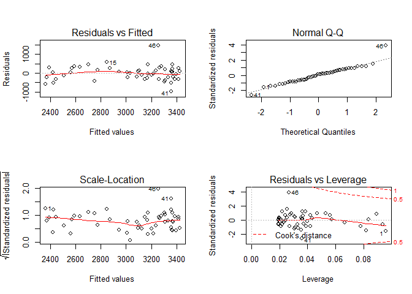
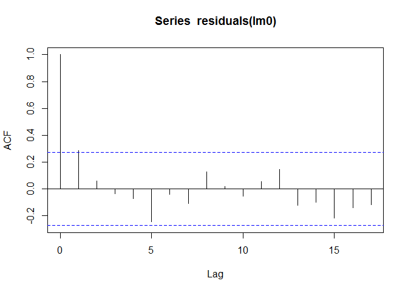
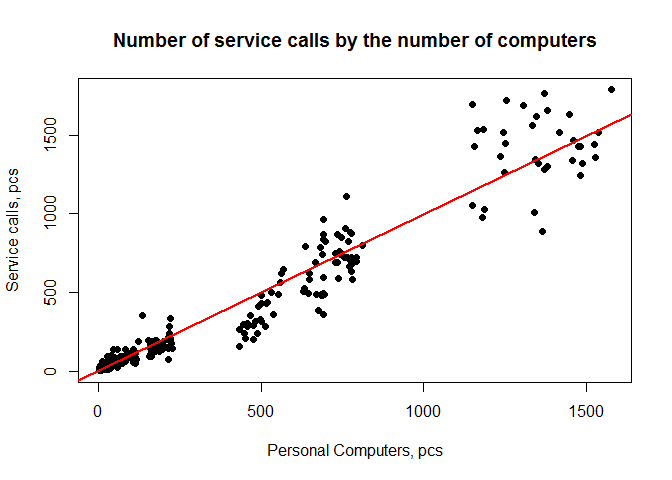
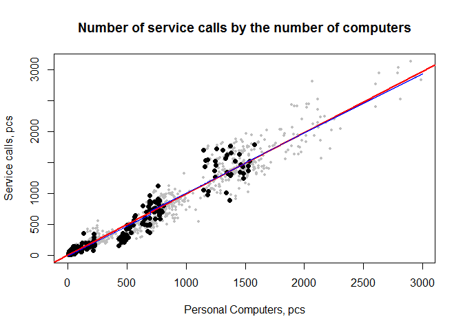
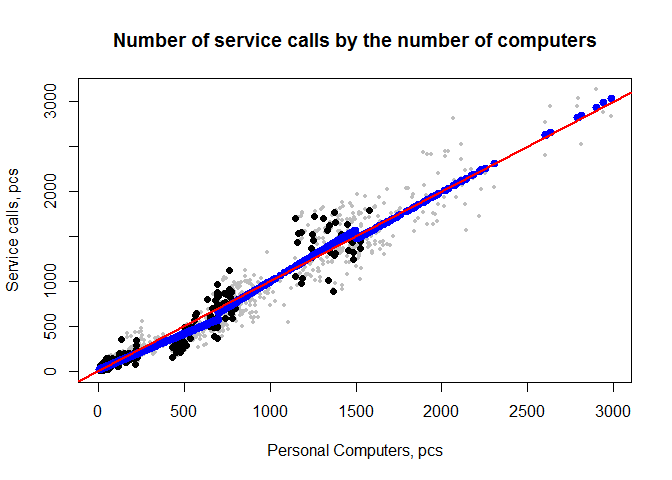

Анализ зависимости количества обращений пользователей от числа обслуживаемых рабочих мест
========================================================


Целью анализа является построение модели, выявлеющей закономерность в количестве обращений пользователей от числа обслуживаемых рабочих мест.
Опубликовано:
*Тушавин В. Многоуровневый регрессионный анализ зависимости количества обращений пользователей от числа обслуживаемых рабочих мест // Системы управления и информационные технологии. 2014. № 3.2 (57). С. 278–280.*

### Получение данных

Загружаем исходные данные

```r
SCandPC.raw<-readRDS("SC_and_PC.RDa")
# Dimension of dataset
dim(SCandPC.raw)
```

```
## [1] 642   5
```

```r
# First rows
head(SCandPC.raw)
```

```
##   Year Month   Org   PC  SC
## 1 2010     1 Org_1   34  33
## 2 2010     1 Org_2 1140 890
## 3 2010     1 Org_4    7  16
## 4 2010     1 Org_5  432 153
## 5 2010     1 Org_6    6   5
## 6 2010     1 Org_8  159  90
```

### Регрессионный анализ зависимости количества обращений пользователей от числа обслуживаемых рабочих мест как процесса

Проведем анализ только по всем предприятиям, для чего просуммируем данные по всем предприятиям для каждого периода и построим линейную модель КМНК.


```r
SCandPC.sum<-aggregate(cbind(PC,SC)~Month+Year,data=SCandPC.raw,sum)
dim(SCandPC.sum)
```

```
## [1] 52  4
```

```r
head(SCandPC.sum)
```

```
##   Month Year   PC   SC
## 1     1 2010 2552 1792
## 2     2 2010 2560 2139
## 3     3 2010 2577 2695
## 4     4 2010 2600 2464
## 5     5 2010 2606 1904
## 6     6 2010 2623 2140
```

```r
summary(lm0<-lm(SC~PC,data=SCandPC.sum))
```

```
## 
## Call:
## lm(formula = SC ~ PC, data = SCandPC.sum)
## 
## Residuals:
##     Min      1Q  Median      3Q     Max 
## -964.16 -238.88   39.47  226.80 1450.52 
## 
## Coefficients:
##              Estimate Std. Error t value Pr(>|t|)    
## (Intercept) -708.8841   579.6475  -1.223    0.227    
## PC             1.2032     0.1851   6.499 3.65e-08 ***
## ---
## Signif. codes:  0 '***' 0.001 '**' 0.01 '*' 0.05 '.' 0.1 ' ' 1
## 
## Residual standard error: 379.2 on 50 degrees of freedom
## Multiple R-squared:  0.4579,	Adjusted R-squared:  0.4471 
## F-statistic: 42.24 on 1 and 50 DF,  p-value: 3.646e-08
```

```r
oldpar<-par(mfrow=c(2,2))
plot(lm0)
```

 

```r
par(oldpar)
```

Проведем тесты  на авторегерессию и гетероскедатичность


```r
library(car)
acf(residuals(lm0))
```

 

```r
ncvTest(lm0)
```

```
## Non-constant Variance Score Test 
## Variance formula: ~ fitted.values 
## Chisquare = 0.6701576    Df = 1     p = 0.4129967
```


Дисперсионный анализ зависимости остатков модели от времени


```r
y<-residuals(lm0)
x<-1:length(y)
summary(lm(y~x))
```

```
## 
## Call:
## lm(formula = y ~ x)
## 
## Residuals:
##      Min       1Q   Median       3Q      Max 
## -1005.68  -245.84    28.51   200.44  1394.69 
## 
## Coefficients:
##             Estimate Std. Error t value Pr(>|t|)
## (Intercept)  -75.876    105.982  -0.716    0.477
## x              2.863      3.480   0.823    0.415
## 
## Residual standard error: 376.6 on 50 degrees of freedom
## Multiple R-squared:  0.01336,	Adjusted R-squared:  -0.006374 
## F-statistic: 0.677 on 1 and 50 DF,  p-value: 0.4145
```

Иными словами, остатки модели - белый шум. Построим другую модель, которая учитывает только зависимость количества обращений пользователей от числа обслуживаемых рабочих мест и не зависит от времени.

### Построение предиктивной модели

Для начала разделим данные на два блока: данные для построения модели и данные для её верификации


```r
total.rows<-dim(SCandPC.raw)[1]
set.seed(118)
test.idx<-sample(1:total.rows,total.rows/4)
SCandPC.test<-SCandPC.raw[test.idx,]
dim(SCandPC.test)
```

```
## [1] 160   5
```

```r
SCandPC.mdl<-SCandPC.raw[-test.idx,]
dim(SCandPC.mdl)
```

```
## [1] 482   5
```

#### Модель без учета размера предприятия


```r
summary(lm1<-lm(SC~PC,data=SCandPC.mdl))
```

```
## 
## Call:
## lm(formula = SC ~ PC, data = SCandPC.mdl)
## 
## Residuals:
##     Min      1Q  Median      3Q     Max 
## -481.03  -13.77    7.52   17.42  547.50 
## 
## Coefficients:
##             Estimate Std. Error t value Pr(>|t|)    
## (Intercept) -8.54898    4.95846  -1.724   0.0853 .  
## PC           1.00701    0.01093  92.171   <2e-16 ***
## ---
## Signif. codes:  0 '***' 0.001 '**' 0.01 '*' 0.05 '.' 0.1 ' ' 1
## 
## Residual standard error: 92.38 on 480 degrees of freedom
## Multiple R-squared:  0.9465,	Adjusted R-squared:  0.9464 
## F-statistic:  8496 on 1 and 480 DF,  p-value: < 2.2e-16
```

```r
confint(lm1)
```

```
##                   2.5 %   97.5 %
## (Intercept) -18.2919435 1.193986
## PC            0.9855465 1.028482
```

Полученный результат хорошо согласуется с ранее опубликованной моделью. После исключения свободного члена получаем


```r
summary(lm1.1<-lm(SC~PC-1,data=SCandPC.mdl))
```

```
## 
## Call:
## lm(formula = SC ~ PC - 1, data = SCandPC.mdl)
## 
## Residuals:
##     Min      1Q  Median      3Q     Max 
## -475.97  -20.43    0.00    9.05  550.39 
## 
## Coefficients:
##    Estimate Std. Error t value Pr(>|t|)    
## PC 0.997050   0.009291   107.3   <2e-16 ***
## ---
## Signif. codes:  0 '***' 0.001 '**' 0.01 '*' 0.05 '.' 0.1 ' ' 1
## 
## Residual standard error: 92.57 on 481 degrees of freedom
## Multiple R-squared:  0.9599,	Adjusted R-squared:  0.9598 
## F-statistic: 1.152e+04 on 1 and 481 DF,  p-value: < 2.2e-16
```

```r
confint(lm1.1)
```

```
##        2.5 %   97.5 %
## PC 0.9787946 1.015306
```

```r
sd(residuals(lm1.1))
```

```
## [1] 92.36843
```

Графичеcки это выглядит следующим образом


```r
plot(SCandPC.mdl$SC~SCandPC.mdl$PC,xlab="Personal Computers, pcs", ylab="Service calls, pcs",main="Number of service calls by the number of computers",pch=19)
abline(lm1.1,col="red",lwd=2)
```

 


#### Модель c учетом размеров предприятия

Как видно на предыдущем рисунке, имеются определенные провалы в данных. Для того, чтобы их избежать сгенерируем для построения модели случайные данные, равные сумме двух случаных событий.

Иными словами, симулируем определенное количество случайных событий для неких абстрактных холдингов, включающих в себя два случайных предприятия с известным количеством персональных компьютеров, равных их сумме и известным количеством обращений, также равным сумме обращений.


```r
set.seed(2014)
rows<-nrow(SCandPC.mdl)
iid1<-sample(1:rows,2000,replace=T)
iid2<-sample(1:rows,2000,replace=T)
 
test<-data.frame(PC=SCandPC.mdl$PC[iid1]+SCandPC.mdl$PC[iid2],SC=SCandPC.mdl$SC[iid1]+SCandPC.mdl$SC[iid2])
dim(test)
```

```
## [1] 2000    2
```
Снова определим коэффициенты линейной модели


```r
summary(lm1.2<-lm(SC~PC-1,data=test))
```

```
## 
## Call:
## lm(formula = SC ~ PC - 1, data = test)
## 
## Residuals:
##     Min      1Q  Median      3Q     Max 
## -558.31  -51.61   -5.47   19.30  760.56 
## 
## Coefficients:
##    Estimate Std. Error t value Pr(>|t|)    
## PC 0.987647   0.003876   254.8   <2e-16 ***
## ---
## Signif. codes:  0 '***' 0.001 '**' 0.01 '*' 0.05 '.' 0.1 ' ' 1
## 
## Residual standard error: 127.3 on 1999 degrees of freedom
## Multiple R-squared:  0.9701,	Adjusted R-squared:  0.9701 
## F-statistic: 6.494e+04 on 1 and 1999 DF,  p-value: < 2.2e-16
```

```r
confint(lm1.2)
```

```
##        2.5 %    97.5 %
## PC 0.9800465 0.9952481
```

Также предположим, что существуют три типа предприятий: малое, среднее и большое, для которых происходит качественное изменение в количестве обращений. Найдем эти границы сравнивая линейные модели по критерию Акаике.


```r
z.min<-c()
z.max<-c()
z.aic<-c()
for(i in seq(0,3000,by=50)) for(j in seq(50,2950,by=50)) {
  z.min<-c(z.min,i)  
  z.max<-c(z.max,j) 
  test$type<-"M"
  test$type[test$SC<i]<-"S"
  test$type[test$SC>j]<-"L"
  lmp<-lm(SC~PC+type-1,data=test)
  z.aic<-c(z.aic,AIC(lmp))
}
print(x1<-z.min[which(z.aic==min(z.aic))])
```

```
## [1] 700
```

```r
print(x2<-z.max[which(z.aic==min(z.aic))])
```

```
## [1] 1500
```

Построим результирующую линейную регрессию


```r
test$type<-"M"
test$type[test$PC<x1[1]]<-"S"
test$type[test$PC>x2[1]]<-"L"
summary(lmp<-lm(SC~PC+type-1,data=test))
```

```
## 
## Call:
## lm(formula = SC ~ PC + type - 1, data = test)
## 
## Residuals:
##     Min      1Q  Median      3Q     Max 
## -569.74  -43.98    8.35   32.06  764.60 
## 
## Coefficients:
##        Estimate Std. Error t value Pr(>|t|)    
## PC      0.95661    0.01245  76.844  < 2e-16 ***
## typeL  60.18076   25.20321   2.388  0.01704 *  
## typeM  45.82085   14.06962   3.257  0.00115 ** 
## typeS -12.66324    4.05504  -3.123  0.00182 ** 
## ---
## Signif. codes:  0 '***' 0.001 '**' 0.01 '*' 0.05 '.' 0.1 ' ' 1
## 
## Residual standard error: 126.1 on 1996 degrees of freedom
## Multiple R-squared:  0.9707,	Adjusted R-squared:  0.9707 
## F-statistic: 1.656e+04 on 4 and 1996 DF,  p-value: < 2.2e-16
```

```r
confint(lmp) 
```

```
##             2.5 %      97.5 %
## PC      0.9321914   0.9810189
## typeL  10.7533951 109.6081213
## typeM  18.2281630  73.4135344
## typeS -20.6157929  -4.7106849
```

```r
plot(test$SC~test$PC,pch=19,col="grey",cex=0.5,xlab="Personal Computers, pcs", ylab="Service calls, pcs",main="Number of service calls by the number of computers")
points(SCandPC.mdl$SC~SCandPC.mdl$PC,pch=19)

abline(lm1.2,col="red",lwd=2)

fit1<-data.frame(PC<-1:3000)
fit1$type<-"M"
fit1$type[fit1$PC<x1[1]]<-"S"
fit1$type[fit1$PC>x2[1]]<-"L"
fit1$SC<-predict(lmp,newdata=fit1)
lines(fit1$PC,fit1$SC,col="blue")
```

 

Проведем дисперсионный анализ моделей


```r
anova(lm1.2,lmp)
```

```
## Analysis of Variance Table
## 
## Model 1: SC ~ PC - 1
## Model 2: SC ~ PC + type - 1
##   Res.Df      RSS Df Sum of Sq      F    Pr(>F)    
## 1   1999 32388887                                  
## 2   1996 31733306  3    655581 13.745 7.121e-09 ***
## ---
## Signif. codes:  0 '***' 0.001 '**' 0.01 '*' 0.05 '.' 0.1 ' ' 1
```

#### Многоуровневая модель

Подберем многоуровневую модель. Для начала построим предыдущую модель, а затем  проведем дисперсионный анализ моделей


```r
library(lme4)
```

```
## Loading required package: Matrix
## Loading required package: Rcpp
```

```r
summary(M0<-lmer(SC~PC+(1|type),data=test))
```

```
## Linear mixed model fit by REML ['lmerMod']
## Formula: SC ~ PC + (1 | type)
##    Data: test
## 
## REML criterion at convergence: 25031.7
## 
## Scaled residuals: 
##     Min      1Q  Median      3Q     Max 
## -4.5190 -0.3511  0.0697  0.2560  6.0695 
## 
## Random effects:
##  Groups   Name        Variance Std.Dev.
##  type     (Intercept)  1190     34.5   
##  Residual             15899    126.1   
## Number of obs: 2000, groups:  type, 3
## 
## Fixed effects:
##             Estimate Std. Error t value
## (Intercept) 23.84011   23.31992    1.02
## PC           0.96302    0.01153   83.49
## 
## Correlation of Fixed Effects:
##    (Intr)
## PC -0.487
```

```r
coef(M0)
```

```
## $type
##   (Intercept)        PC
## L    46.19156 0.9630203
## M    38.78765 0.9630203
## S   -13.45890 0.9630203
## 
## attr(,"class")
## [1] "coef.mer"
```

```r
summary(M1<-lmer(SC~PC+(1+PC|type),data=test))
```

```
## Linear mixed model fit by REML ['lmerMod']
## Formula: SC ~ PC + (1 + PC | type)
##    Data: test
## 
## REML criterion at convergence: 24861.8
## 
## Scaled residuals: 
##     Min      1Q  Median      3Q     Max 
## -4.8384 -0.2756 -0.0571  0.2016  6.1430 
## 
## Random effects:
##  Groups   Name        Variance  Std.Dev. Corr 
##  type     (Intercept) 1.476e+04 121.4913      
##           PC          6.494e-02   0.2548 -1.00
##  Residual             1.455e+04 120.6293      
## Number of obs: 2000, groups:  type, 3
## 
## Fixed effects:
##             Estimate Std. Error t value
## (Intercept) -78.4135    70.3705  -1.114
## PC            0.9970     0.1472   6.773
## 
## Correlation of Fixed Effects:
##    (Intr)
## PC -0.997
```

```r
coef(M1)
```

```
## $type
##   (Intercept)        PC
## L  -101.94126 1.0463568
## M  -148.94478 1.1449467
## S    15.64548 0.7997185
## 
## attr(,"class")
## [1] "coef.mer"
```

```r
plot(test$SC~test$PC,pch=19,col="grey",cex=0.5,xlab="Personal Computers, pcs", ylab="Service calls, pcs",main="Number of service calls by the number of computers")
points(SCandPC.mdl$SC~SCandPC.mdl$PC,pch=19)

points(test$PC,predict(M1),col="blue",pch=19,lwd=2)
abline(lm1.1,col="red",lwd=2)
```

 

```r
anova(M0,M1)
```

```
## refitting model(s) with ML (instead of REML)
```

```
## Data: test
## Models:
## M0: SC ~ PC + (1 | type)
## M1: SC ~ PC + (1 + PC | type)
##    Df   AIC   BIC logLik deviance  Chisq Chi Df Pr(>Chisq)    
## M0  4 25040 25062 -12516    25032                             
## M1  6 24877 24911 -12432    24865 167.03      2  < 2.2e-16 ***
## ---
## Signif. codes:  0 '***' 0.001 '**' 0.01 '*' 0.05 '.' 0.1 ' ' 1
```

Как видно из расчетов, вторая модель оказывается лучше.

Необходимые коэффициенты:

```r
confint(M1,method="Wald")
```

```
##                    2.5 %    97.5 %
## (Intercept) -216.3371756 59.510132
## PC             0.7084818  1.285533
```

```r
fixef(M1)
```

```
## (Intercept)          PC 
## -78.4135219   0.9970074
```

```r
ranef(M1)
```

```
## $type
##   (Intercept)          PC
## L   -23.52774  0.04934946
## M   -70.53126  0.14793939
## S    94.05900 -0.19728885
```

